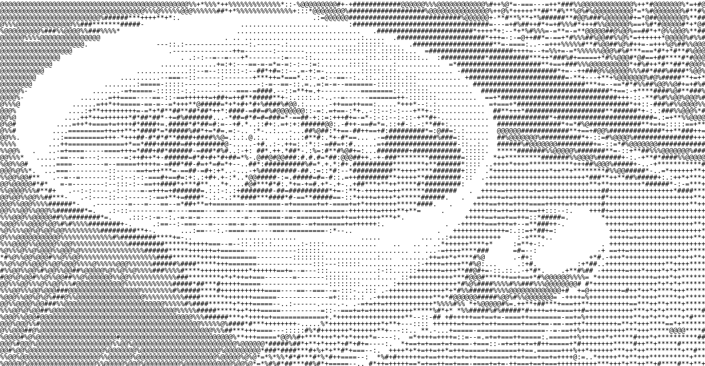

# Validation

Pour composer buchi avec un automate, on place buchi se trouve à droite et l'automate à gauche.

## Utilisation

Pour utiliser le code, des fichiers mains se trouvent dans la racine du projet.

* Dans mainHanoi.py, on peut parcourir le graph d'Hanoi, de même dans mainHanoiRootedRelation.py

* Dans mainAlice_et_Bob.py, on va pouvoir exécuter les deux versions de 'Alice et Bob' : celle naive sans drapeau 
(avec priorité à Alice), et celle avec des drapeaux et un troisième état. Ces deux versions s'exécutent deux fois en
tout. En effet, elles s'exécutent pour le __RootedRelation__,pour le __SoupSemantics__ et pour le __StepSemantics__.
Pour choisir la version qu'on souhaite exécuter, il suffit de modifier la variable *v* : 1 pour la version 1, n'importe
quoi d'autre pour la version 2.

* Un profileur a été créé. Pour l'utiliser, il suffit de placer le décorateur @profileur.profileur au dessus de la fonction
dont on veut connaitre le temps d'exécution. À la fin de l'exécution de Alice et Bob, celui-ci affiche les statistiques
liés à l'exécution de Alice et Bob. Pour le remettre à 0, il suffit d'utiliser la fonction profileur.reset().

## Remarques

Une esquisse de la vivacité a été écrite dans Vivacity.py mais ne fonctionne pas.

