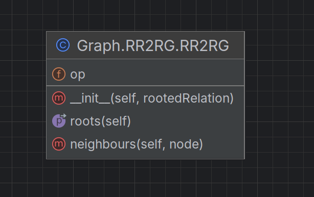
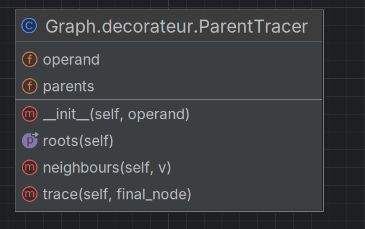

# Validation

Pour composer buchi avec un automate, on place buchi se trouve à droite et l'automate à gauche.

## Utilisation

Pour utiliser le code, des fichiers mains se trouvent dans la racine du projet.

* Dans mainHanoi.py, on peut parcourir le graph d'Hanoi, de même dans mainHanoiRootedRelation.py

* Dans mainAlice_et_Bob.py, on va pouvoir exécuter les deux versions de 'Alice et Bob' : celle naive sans drapeau 
(avec priorité à Alice), et celle avec des drapeaux et un troisième état. Ces deux versions s'exécutent deux fois en
tout. En effet, elles s'exécutent pour le __RootedRelation__ et pour le __SoupSemantics__.
Pour choisir la version qu'on souhaite exécuter, il suffit de modifier la variable *v* : 1 pour la version 1, n'importe
quoi d'autre pour la version 2.

Que se passe-t-il lors de l'exécution de Alice et Bob : 
* On cherche à voir si Alice et Bob se retrouvent dans la section critique en même temps
* On cherche ensuite à savoir s'il y a un deadlock.

## Architecture

Pour un graph donné, quel que soit son type, on va pouvoir créer un operand qui va ensuite être parcouru : 

Nous avons donc la classe RR2RG qui pour un graph donné, va avoir deux méthodes : 
* __roots__ qui va renvoyer le résultat de op.initial() (op étant le graph que l'on souhaite parcourir)
* __neihghbours__ qui pour un nœud, va calculer les actions possibles (op.actions()) puis exécuter chacune de ces 
actions (op.execute() pour toute action à ce nœud ...)

Ceci permet d'avoir un operand.

On va pouvoir appliquer un ParentTracer à cet operand : 

Cette classe va nous permettre de retracer le chemin parcouru par le graph pour atteindre le final_node (fonction trace).

Alors, il nous suffit d'appliquer la fonction predicate_finder pour un prédicat défini au préalable (défini à chaque 
fois dans des fichiers à part), et cette fonction va faire parcourir le graph par bfs_trans jusqu'à trouver le prédicat,
ou avoir parcouru tous les nœuds.

Le prédicat peut très bien être un nœud en particulier ou bien un dead lock (grâce à la fonction has_deadlock).