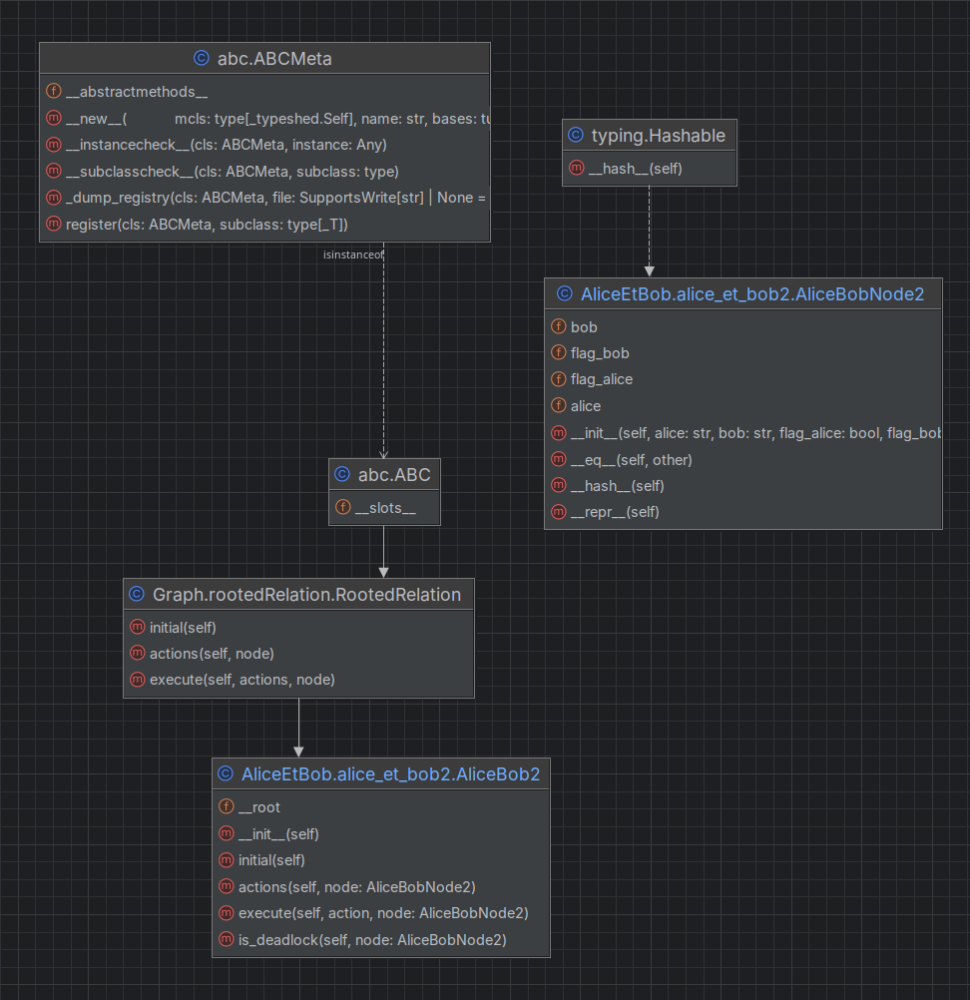

## Architecture

Plaçons-nous dans le cas de la version 2 de Alice et Bob RootedRelation.
Nous avons les deux classes suivantes : 

* AliceEtBobNode qui est un nœud du graph (utilisé par l'objet AliceBob2)
Cet objet implémente les fonctions __eq__ et __hash__ pour permettre sa comparaison avec d'autres objets du même type.
La fonction __repr__ est également implémenté pour faciliter le débogage et favoriser un bel affichage final.
Enfin, cette classe possède 4 attributs : 
    * alice : donne l'état d'Alice à ce nœud ('i', 'w' ou 'c')
    * flag_alice : donne l'état du drapeau d'Alice à ce nœud (False si n'est pas utilisé, True si utilisé)
    * Et bob / flag_bob, sont la même chose, mais pour Bob.
  
* AliceBob2 qui sert à faire évoluer le graph. Ainsi, elle possède les quatre méthodes __initial__, __actions__, 
__execute__ et __is_deadlock__.
  * __initial__ permet de renvoyer la racine du graph : il s'agit du premier nœud (sous forme de liste)
  * __actions__ qui pour un nœud donné va renvoyer tous les mouvements qu'on peut réaliser (renvoie une liste)
  * __execute__ qui va exécuter une configuration pour un nœud donné
  * __is_deadlock__ qui permet de vérifier si on est dans un dead_lock.

À partir de ça, nous allons pouvoir créer un operand.